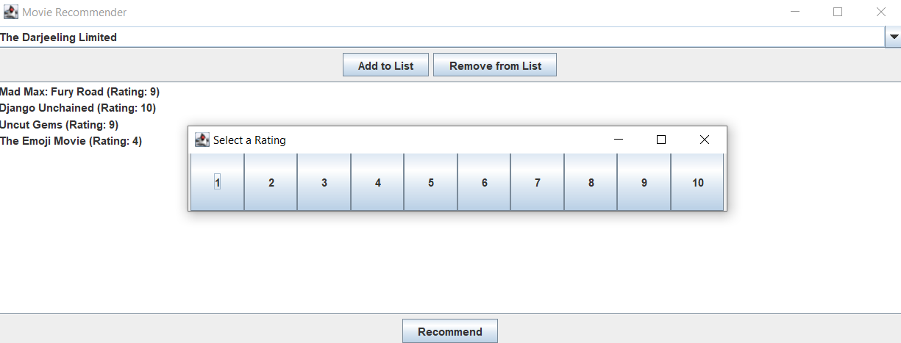
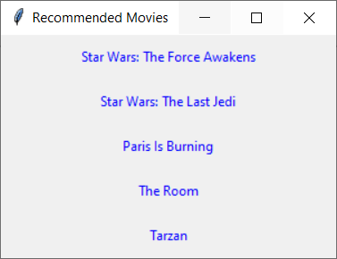

# FrankenFilms

Sistema de recomendações de filmes feito em Python, baseado em [dados de usuários](https://www.kaggle.com/datasets/samlearner/letterboxd-movie-ratings-data/data?select=ratings_export.csv) (2021).

Projeto desenvolvido por Thiago Calheiros de Souza Barbosa, Pedro Henrique Gallio Bulcão e João Vitor Camelo de Almeida, para a disciplina de Laboratório de Programação 2, do professor Cel Anderson. 


## Passo a passo
Caso não possua o Python instalado em sua máquina, acesse este [link](https://www.python.org/downloads/) e siga as intruções.

Clone o projeto

```bash
git clone https://github.com/PedroHGBulcao/PyFrankenFilms.git
```

Entre no diretório do projeto

```bash
cd .\PyFrankenFIlms
```
Execute o programa

```bash 
python FrankenFilms.py
```

Escolha o filme que deseja avaliar e selecione a nota correspondente à sua avaliação





Clique no botão Recommend e receba as opções de filmes que se alinham às suas avaliações. 

Ao clicar sobre o filme desejado, você será redirecionado à página IMDB do filme no seu navegador padrão.